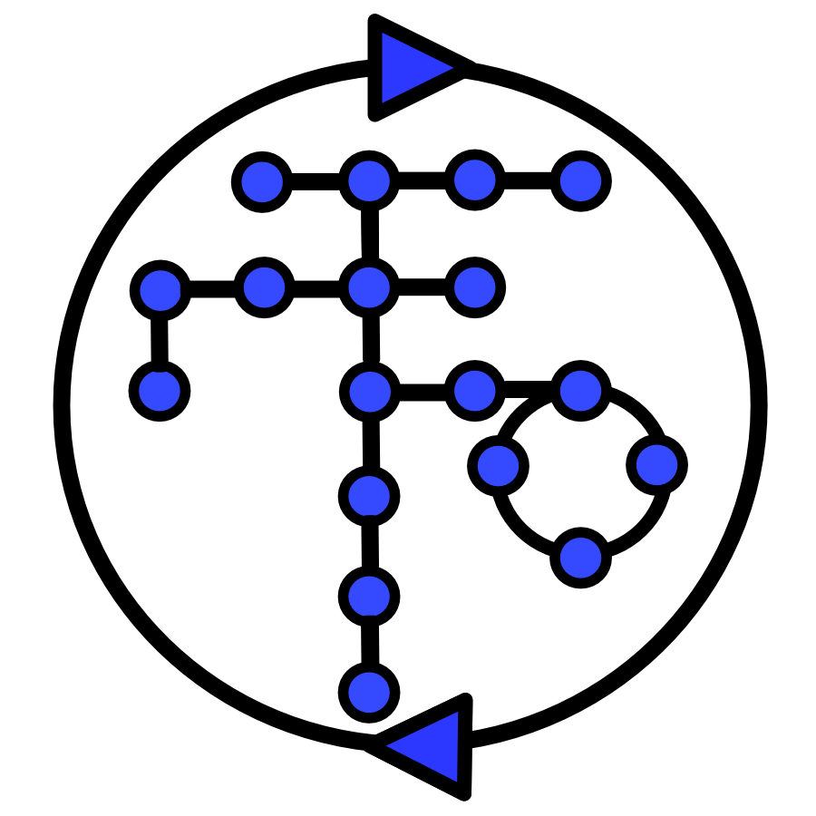

# MiMB_reproducible_biomodeling


<!-- PROJECT SHIELDS -->
<!--
*** I'm using markdown "reference style" links for readability.
*** Reference links are enclosed in brackets [ ] instead of parentheses ( ).
*** See the bottom of this document for the declaration of the reference variables
*** for contributors-url, forks-url, etc. This is an optional, concise syntax you may use.
*** https://www.markdownguide.org/basic-syntax/#reference-style-links
-->
[![Contributors][contributors-shield]][contributors-url]
[![Forks][forks-shield]][forks-url]
[![Stargazers][stars-shield]][stars-url]
[![Issues][issues-shield]][issues-url]
[![MIT License][license-shield]][license-url]
[![LinkedIn][linkedin-shield]][linkedin-url]


<!-- PROJECT LOGO -->
<br />
<p align="center">
  <a href="https://github.com/vporubsky/MiMB_reproducible_biomodeling">
    
  </a>

  <h3 align="center">MiMB_reproducible_biomodeling</h3>

  <p align="center">
    All materials associated with the chapter for Methods in Molecular Biology entitled, 
    "A practical guide to reproducible modeling for signaling networks" are contained in this 
    repository.

<br />
<a href="https://github.com/vporubsky/MiMB_reproducible_biomodeling"><strong>Explore the docs »</strong></a>
<br />
<br />
<a href="https://github.com/vporubsky/MiMB_reproducible_biomodeling">View Demo</a>
·
<a href="https://github.com/vporubsky/MiMB_reproducible_biomodeling/issues">Report Bug</a>
·
<a href="https://github.com/vporubsky/MiMB_reproducible_biomodeling/issues">Request Feature</a>
</p>


<!-- TABLE OF CONTENTS -->
<details open="open">
  <summary><h2 style="display: inline-block">Table of Contents</h2></summary>
  <ol>
    <li>
      <a href="#about-the-project">About The Project</a>
    </li>
    <li>
      <a href="#getting-started">Getting Started</a>
      <ul>
        <li><a href="#prerequisites">Prerequisites</a></li>
        <li><a href="#installation">Installation</a></li>
      </ul>
    </li>
    <li><a href="#usage">Usage</a></li>
    <li><a href="#contributing">Contributing</a></li>
    <li><a href="#license">License</a></li>
    <li><a href="#contact">Contact</a></li>
  </ol>
</details>


<!-- ABOUT THE PROJECT -->
## About The Project

[![MiMB Reproducible Modeling Screen Shot][product-screenshot]](https://raw.githubusercontent.com/vporubsky/MiMB_reproducible_biomodeling/main/images/figure_1.png)

While scientific disciplines revere reproducibility, many studies - experimental and computational alike - fall short of this ideal and cannot be reproduced or even repeated when the model is shared. For computational modeling of biochemical networks, there is a dearth of formal training and resources available describing how to practically implement reproducible methods, despite a wealth of existing tools and formats which could be used to support reproducibility. This chapter points the reader to useful software tools and standardized formats that support reproducible modeling of biochemical networks and provides suggestions on how to implement reproducible methods in practice. Many of the suggestions encourage readers to use best practices from the software development community in order to automate, test, and version control their model components. A Jupyter Notebook demonstrating several of the key steps in building a reproducible biochemical network model is included to supplement the recommendations in the text.

<!-- GETTING STARTED -->
## Getting Started

To get a local copy up and running follow these simple steps.

### Prerequisites

All software dependencies required to run the code contained in this repository using the same versions employed during development.
* Python 3.8.2
* pip packages
  ```sh
  pip install bioservices==1.7.11
  ```
    ```sh
  pip install tellurium==2.1.6
  ```
  ```sh
  pip install matplotlib==3.3.4
  ```
  ```sh
  pip install IPython==7.12.0
  ```
  ```sh
  pip install libsbgnpy
  ```
  ```sh
  pip install sbmllint
  ```
  ```sh
  pip install sbmlutils~=0.4.9
  ```
  ```sh
  pip install phrasedml~=1.1.1
  ```
  ```sh
  pip install h5py~=3.1.0
  ```
  ```sh
  pip install pandas~=1.2.2
  ```
  ```sh
  pip install seaborn~=0.11.0
  ```
    ```sh
  pip install scikit-learn~=0.24.1
  ```
    ```sh
  pip install lmfit~=1.0.1
  ```


### Installation

Clone the repo
   ```sh
   git clone https://github.com/vporubsky/MiMB_reproducible_biomodeling.git
   ```


<!-- USAGE EXAMPLES -->
## Usage

This is intended as an introduction to reproducible biochemical modeling in Python. 

### Data Aggregation
[![MiMB Reproducible Modeling Figure 2][fig2-screenshot]](https://raw.githubusercontent.com/vporubsky/MiMB_reproducible_biomodeling/main/images/figure_2.png)
### Documentation, Version Control, and Annotation
[![MiMB Reproducible Modeling Figure 3][fig3-screenshot]](https://raw.githubusercontent.com/vporubsky/MiMB_reproducible_biomodeling/main/images/figure_3.png)
### Simulation
[![MiMB Reproducible Modeling Figure 4][fig4-screenshot]](https://raw.githubusercontent.com/vporubsky/MiMB_reproducible_biomodeling/main/images/figure_4.png)
### Parameter Estimation
[![MiMB Reproducible Modeling Figure 5][fig5-screenshot]](https://raw.githubusercontent.com/vporubsky/MiMB_reproducible_biomodeling/main/images/figure_5.png)
### Verification and Validation
[![MiMB Reproducible Modeling Figure 6][fig6-screenshot]](https://raw.githubusercontent.com/vporubsky/MiMB_reproducible_biomodeling/main/images/figure_6.png)


<!-- LICENSE -->
## License

Distributed under the MIT License. See `LICENSE` for more information.


<!-- CONTACT -->
## Contact

Veronica Porubksy - verosky@uw.edu

Project Link: [https://github.com/vporubsky/MiMB_reproducible_biomodeling](https://github.com/vporubsky/MiMB_reproducible_biomodeling)


<!-- MARKDOWN LINKS & IMAGES -->
<!-- https://www.markdownguide.org/basic-syntax/#reference-style-links -->
[contributors-shield]: https://img.shields.io/github/contributors/github_username/repo.svg?style=for-the-badge
[contributors-url]: https://github.com/vporubsky/MiMB_reproducible_biomodeling/graphs/contributors
[forks-shield]: https://img.shields.io/github/forks/github_username/repo.svg?style=for-the-badge
[forks-url]: https://github.com/vporubsky/MiMB_reproducible_biomodeling/network/members
[stars-shield]: https://img.shields.io/github/stars/github_username/repo.svg?style=for-the-badge
[stars-url]: https://github.com/vporubsky/MiMB_reproducible_biomodeling/stargazers
[issues-shield]: https://img.shields.io/github/issues/github_username/repo.svg?style=for-the-badge
[issues-url]: https://github.com/vporubsky/MiMB_reproducible_biomodeling/issues
[license-shield]: https://img.shields.io/github/license/github_username/repo.svg?style=for-the-badge
[license-url]: https://github.com/vporubsky/MiMB_reproducible_biomodeling/blob/master/LICENSE.txt
[linkedin-shield]: https://img.shields.io/badge/-LinkedIn-black.svg?style=for-the-badge&logo=linkedin&colorB=555
[linkedin-url]: https://www.linkedin.com/in/veronica-porubsky/
[product-screenshot]: https://github.com/vporubsky/MiMB_reproducible_biomodeling/blob/main/images/BIOMD0000000012_parameter_estimation_histograms.png
[fig2-screenshot]: https://raw.githubusercontent.com/vporubsky/MiMB_reproducible_biomodeling/main/images/figure_2.png
[fig3-screenshot]: https://raw.githubusercontent.com/vporubsky/MiMB_reproducible_biomodeling/main/images/figure_3.png
[fig4-screenshot]: https://raw.githubusercontent.com/vporubsky/MiMB_reproducible_biomodeling/main/images/figure_4.png
[fig5-screenshot]: https://raw.githubusercontent.com/vporubsky/MiMB_reproducible_biomodeling/main/images/figure_5.png
[fig6-screenshot]: https://raw.githubusercontent.com/vporubsky/MiMB_reproducible_biomodeling/main/images/figure_6.png
